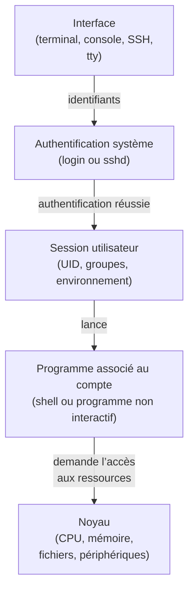

## 2.3b Authentification et ouverture de session

Sur un système Unix/Linux, il est essentiel de distinguer **l’authentification** de **l’ouverture de session**, même si ces deux étapes sont souvent assurées par le même programme (`login` en local, `sshd` à distance).

**L’authentification** répond à la question _« Qui es tu ? »_.  
Elle consiste uniquement à vérifier une identité à l’aide d’un mot de passe ou d’une clé SSH. Conceptuellement, cette étape s’appuie sur **`/etc/shadow`**, qui contient les informations nécessaires à la validation de l’identité. Tant que l’authentification n’a pas abouti, aucun contexte utilisateur n’est créé : aucun UID n’est appliqué et aucun programme utilisateur n’est lancé.

Une fois l’identité validée, vient **l’ouverture de session**. Cette étape définit le **contexte d’exécution** sur le système. Elle s’appuie sur **`/etc/passwd`** et **`/etc/group`**, qui fournissent l’UID, les groupes, le répertoire personnel et le programme associé au compte. C’est à ce moment-là que la session utilisateur est réellement créée.

Le programme associé au compte est alors lancé dans cette session. Il s’agit le plus souvent d’un shell interactif, mais ce choix dépend de l’usage prévu pour le compte.

En résumé :  
**`/etc/shadow` sert à authentifier**,  
**`/etc/passwd` et `/etc/group` servent à ouvrir une session**,  
et **le programme associé au compte est exécuté dans cette session**.

> [!NOTE] **Le shell n’est pas obligatoire**  
> Tous les comptes Unix/Linux n’ont pas vocation à disposer d’un shell interactif. Certains sont destinés uniquement à l’exécution de services ou de commandes automatiques ; leur associer un programme non interactif permet de **restreindre l’accès au système**. Le shell est donc un **outil réservé aux sessions interactives**, pas une obligation générale.


### Travaux dirigés : Connexion SSH vs connexion locale
Nous allons observer la différence entre une **connexion distante (SSH)** et une **connexion locale (console / tty)**. Le but est de comprendre **quel programme authentifie**, **quand une session est créée**, et **ce que devient le shell**.

> [!warning] Pré-requis
> Vous devez absolutment avoir aucun compte de connecté sur votre VM. Si vous avez fait des manipulations et qu'une session est ouverte en local ou à distance fermez absolument tout en tapant exit, autant de fois qu'il le faudra pour n'avoir plus que l'invite de loggin qui s'affiche.

#### Étape 1:  Connexion SSH
Depuis une machine distante connectez-vous à l'aide de ssh:
```sh
ssh alice@IP_DE_LA_VM
```
puis
```sh
alpine:~$ ps | grep alice
```

Résultats attendu:
```sh
 2514 root      0:00 sshd-session: alice [priv]
 2516 alice     0:00 sshd-session: alice@pts/0
 2517 alice     0:00 -sh
 2666 alice     0:00 ps
 2667 alice     0:00 grep alice
alpine:~$ 
```
puis fermez la session ssh avec la commande `exit`.

> [!NOTE] Explications
> La sortie de `ps` montre que la connexion SSH est d’abord prise en charge par un processus exécuté avec l’identité **root**, visible sous la forme `sshd-session: alice [priv]`. Ce processus assure l’authentification et prépare l’ouverture de la session. 
> Une fois l’identité validée, la **session utilisateur** est ouverte et apparaît sous la forme `sshd-session: alice@pts/0`, cette fois exécutée avec l’identité de **alice**. 
> Le shell (`-sh`) est ensuite lancé dans cette session et permet l’exécution des commandes.

#### Étape 2:  Connexion local
Depuis  la console VirtualBox (tty) connectez vous avec le même compte `alice`, puis, dans cette session locale :
```sh
ps | grep alice
```

Résultats attendu:
```sh
alpine:~$ ps | grep alice
 2712 root      0:00 /bin/login -- alice
 2713 alice     0:00 -sh
 2716 alice     0:00 ps
 2717 alice     0:00 grep alice
alpine:~$
```

> [!NOTE] Explications
> La sortie de `ps` montre que la connexion locale est prise en charge par le programme **`login`**, exécuté avec l’identité **root**, visible sous la forme `/bin/login -- alice`. Ce processus assure l’authentification de l’utilisateur et déclenche l’ouverture de la session.  
> Une fois l’identité validée, la **session utilisateur** est ouverte avec l’identité de **alice**, puis le programme associé au compte est lancé, ici un shell (`-sh`) afin de pourvoir intéragir avec le système.

On a pu constater que, selon le mode d’accès, **des programmes différents assurent l’authentification**, tandis que le déroulement général reste identique. Dans le cas d’une connexion distante, l’authentification est prise en charge par **`sshd`** ; dans le cas d’une connexion locale, elle est assurée par **`login`**.

Une fois l’identité validée, le système procède à **l’ouverture d’une session utilisateur**. Cette session est associée à l’identité de l’utilisateur (UID, groupes, environnement) et constitue le **contexte d’exécution** sur le système. Le programme associé au compte est alors lancé dans cette session, le plus souvent un **shell interactif**, qui permet l’exécution des commandes.

Il faut retenir que **ce n’est pas le shell qui est responsable de l’authentification ni de la création de la session** : il s’agit simplement d’un programme exécuté _dans_ une session déjà ouverte.

## 2.4.2 L’environnement de session et les profils

Au moment de son démarrage, le shell **exécute automatiquement certains scripts**, appelés _profils_. Ces scripts définissent ou modifient des **variables d’environnement** (comme `PATH`, `HOME`, `LANG` ou `umask`) qui seront ensuite **héritées par toutes les commandes exécutées depuis ce shell**.

Il existe deux niveaux de configuration.  
1) Le premier est **global** : le fichier `/etc/profile` est exécuté pour tous les utilisateurs lorsqu’un shell de connexion est lancé. Il permet de définir un environnement commun à l’ensemble du système. 
2) Le second est **spécifique à l’utilisateur** : le fichier `~/.profile`, s’il existe, est exécuté après `/etc/profile`. Il permet à chaque utilisateur d’ajuster son environnement personnel sans affecter les autres comptes.

La configuration des profils constitue une **étape essentielle de l’administration d’un système**. Elle permet de **maîtriser et d’homogénéiser la politique d’administration**, en définissant un environnement commun et cohérent pour l’ensemble des utilisateurs.  
Cela permet notamment de :
- définir un PATH standardisé afin de maîtriser l’ordre de recherche des commandes ;
- maîtriser les droits appliqués par défaut lors de la création de fichiers et de répertoires ;
- définir des variables d’environnement système (LANG, TZ, éditeur par défaut) ;
- afficher des messages d’information ou de conformité à l’ouverture de session ;
- définir certains comportements par défaut du shell ;
- préparer l’environnement nécessaire aux applications d’entreprise (outils internes, scripts communs) ;
- appliquer des restrictions simples d’usage (désactivation d’alias non souhaités, paramètres de prudence).


## 2.4.3 **umask**

### Les droits par défault 

Une question pertinente à traiter maintenant serait : **« Quel est le niveau de droits  par défaut d'un utilisateur lors qu'il crée un fichier ? »** . Dit autrement: Si un utilisateur crée un fichier, existe-t-il un risque que le niveau d’accès souhaitable ne soit pas respectés ?

Faisons le test. Connectez-vous avec un compte _développeur_ et créez un fichier dans `/srv/dev/` :

On constate que les fichiers possèdent les droits  **rw-rw-r--**, ce qui est lairement **trop permissif** pour un répertoire censé rester privé au groupe.

Avant d’examiner comment corriger cela, il est important de comprendre **comment ces droits sont exprimés**.  
Linux utilise en effet **deux notations complémentaires** :
- une **notation symbolique**, comme `rw-rw-r--`, pensée pour l’humain. On peut voir d’un coup d’œil qui peut lire, écrire ou exécuter ;
- une **notation octale**, comme `664`, utilisée par les commandes (`chmod`, `umask`) car elle correspond directement au fonctionnement interne du système.

Cette notation octale s’explique par la méthode dont sont tocké les permissions (r, w, x) pour le propirétaire, le groupe et les autres. Chaque droits (r,w,x) est associé à **un bit**, et dfonc ont l'active ou pas. Si on active  :
-  le premier bit `x`(exécution)  vaut **1**
- le second bit `w` (écriture) vaut **2**
- le troisième bit `r`(lecture) vaut **4**

Comment vous le savez dès lors  que l'on active un bit, sa valeur s’ajoute au total du trio. Par exemple :
- activer seulement `x` donne **1**
- activer seulement `w` donne **2**
- activer seulement `r` donne **4**
Mais si on active
-  `r` et `w` cela donne 4 + 2 = **6**
- `r` et `x` cela donne 4 + 1 = **5**
- `w` et `x` cela donne 2 + 1 = **3**
- `r`, `w` et `x` cela donne 4 + 2 + 1 = **7**

Un trio de permissions peut donc produire **8 valeurs possibles**, de 0 (`---`) à 7 (`rwx`).  
Comme ces huit valeurs se représentent naturellement par **un seul chiffre en base 8**, Unix a choisi l’octal pour coder les droits : la valeur octal décrit un trio r/w/x . On a docnt trois bits successifs qui décrivent les droits du propriétaire, puis trois bits pour le groupe et et 3bits pous les autres.

À ces trois catégories classiques — propriétaire, groupe et autres — s’ajoutent enfin trois **bits spéciaux** (SUID, SGID et Sticky), destinés à régler certains comportements particuliers (que l'on verra plus tard).

Voici le tableau complet:
![[2.3b Gestion des droits.png]]

C’est dans ce cadre que s’inscrit **le umask**.

**umask** signifie **User Mask** ou **Permission Mask**.  
C’est un **masque de permissions** appliqué automatiquement par un processus lorsqu’un fichier est créé : il retire certains bits au mode par défaut afin de déterminer les permissions finales.

> [!NOTE]
> **Le umask (User File-Creation Mode Mask)** est une valeur octale propre à chaque processus. Elle n’intervient **que lorsqu’un fichier ou un répertoire est créé** par ce processus : le umask est alors **soustrait** au mode POSIX par défaut afin de déterminer les **permissions finales** de l’objet nouvellement créé.  

Observez comment umask influence les permissions _au moment de la création_ d'un fichier

Démonstration
Affichez le umask actuel :
```
umask
```
Résultat attendu : 
- Pour un dossier : 777 – 022 = 755  
- Pour un fichier : 666 – 022 = 644

Créez un fichier
```
touch test1
ls -l test1
```

Changez le umask en 077
```
umask 077
```
Créez un second fichier :
```
touch test2
ls -l test2
```
Comparez les permissions.
- test1 → `rw-r--r--`
- test2 → `rw-------`

Pour rappel : 

> [!NOTE] umask = **attribut d’un processus**
>  - agit **uniquement lors de la création** de fichiers/répertoires
>  - fonctionne en **retirant** des permissions
>  - n’a **aucun effet après coup**
>  - ne protège pas si le dossier parent est trop permissif
>  - ne doit pas être considéré comme un mécanisme fort de sécurité


> [!NOTE]
> **“The umask is simply a process property. Nothing more, nothing less.”**  
> _(LKML – Linus Torvalds)_


**Travail demandé**  
Appliquer un umask assurant :
- fichiers : 640
- dossiers : 750  
    pour tous les membres de DEV.
    
**Validation**  
Créer un fichier test en tant que DEV → vérifier.

**Notion introduite :**  
umask = masque retiré au mode POSIX par défaut  
(agissant _uniquement_ à la création)

rôle, fonctionnement, configuration permanente
    
## 2.4.4 Politique de sécurité
    
##  2.4.5 Mise en pratique